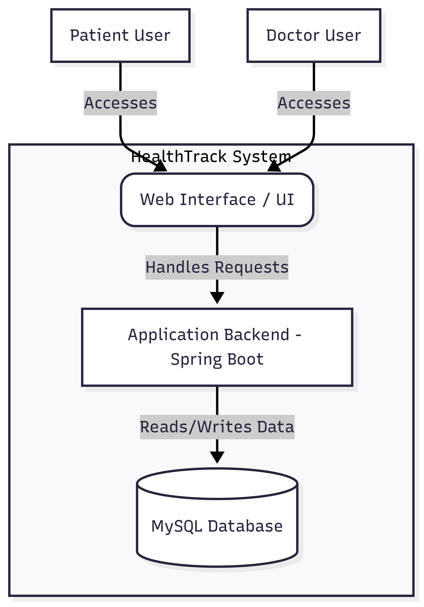
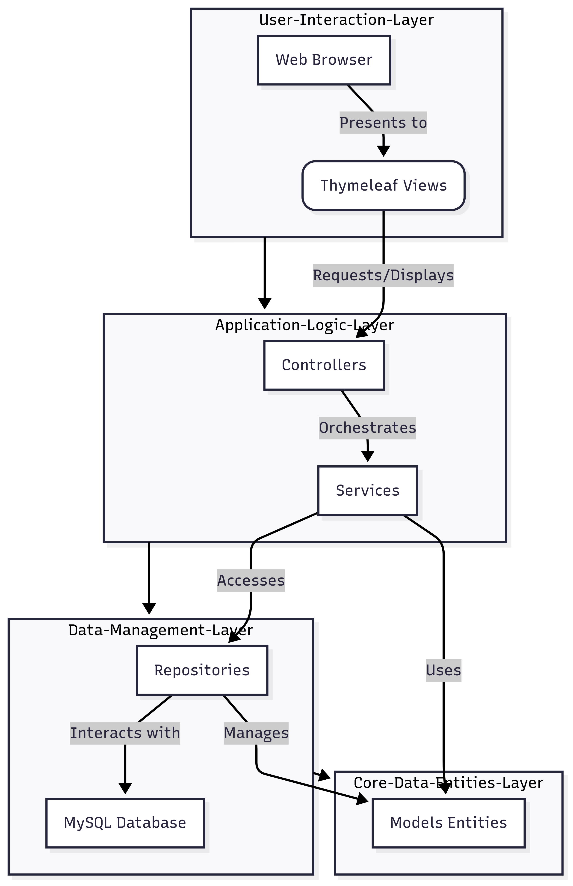
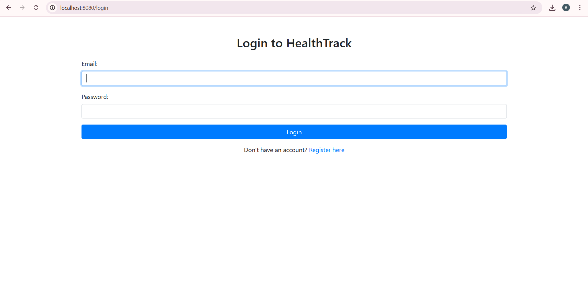
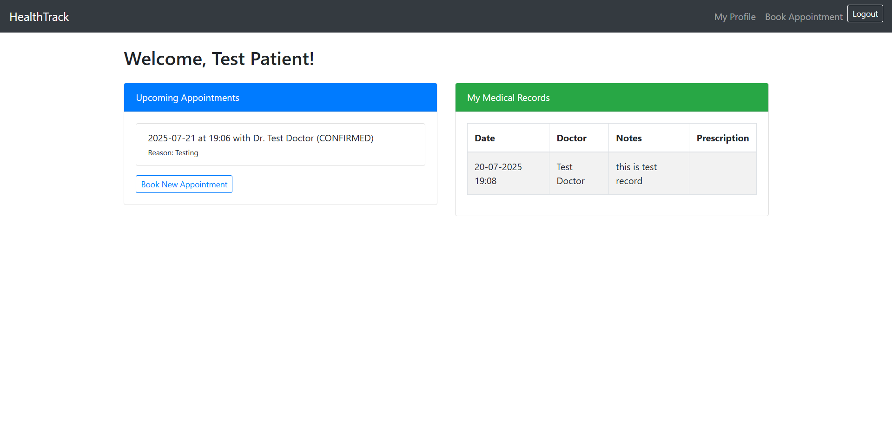
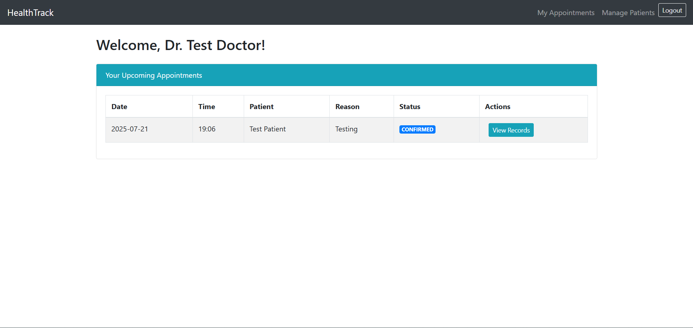
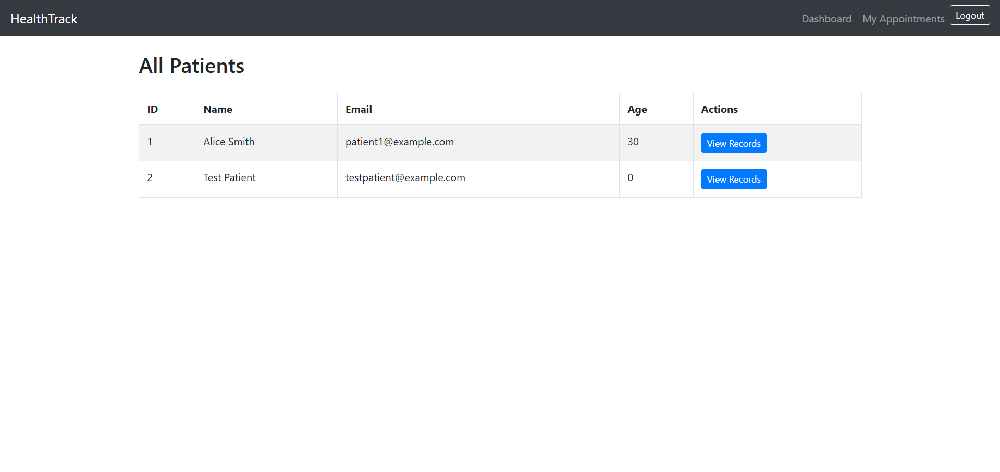

# HealthTrack – Hospital Management System

**HealthTrack** is a web-based hospital management system built using **Spring Boot** and **MySQL**. It streamlines appointment booking, medical record management, and offers secure role-based access for doctors and patients.

---

## High-Level Design (HLD)

  

---

## Low-Level Design (LLD)

  

---

## Features

###  Role-Based Access
- **Patients can**:
  - Register & log in securely
  - Book appointments with doctors
  - View appointment history and medical records
  - Update profile info
- **Doctors can**:
  - View & manage appointments
  - Add/edit patient medical records
  - Access patient list and histories

### Technical Highlights
- Secure authentication with **Spring Security** + **BCrypt**
- Follows **MVC architecture** (Controller → Service → Repository)
- Database integration using **Spring Data JPA**
- Dynamic web pages via **Thymeleaf**
- Responsive UI using **Bootstrap**

---

## Tech Stack

| Category    | Technology                             |
|-------------|-----------------------------------------|
| Backend     | Java 17, Spring Boot 3.5.3              |
| Security    | Spring Security 6.x, BCrypt             |
| Database    | MySQL 8.x                               |
| Frontend    | Thymeleaf, HTML5, CSS3, Bootstrap 4.5   |
| Build Tool  | Maven                                   |

---

##  Getting Started

### Prerequisites
- Java 17+
- MySQL Server
- Maven
- IDE (IntelliJ / VS Code)

### 🛠️ Setup Instructions

#### Create the MySQL Database
#### Configure application.properties
#### Build and Run the Project
- mvn clean install
- mvn spring-boot:run
- Visit the app at: http://localhost:8080

## 🖥️ UI Screenshots

### 🔐 Login Page

  

---

### 👤 Patient Dashboard

  

---

### 👨‍⚕️ Doctor Dashboard

  

---

### 📋 Patient List View

  

